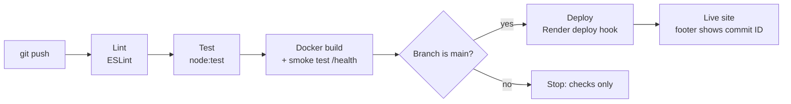

# 🎟️ EventEase — Campus Event Management Portal

EventEase is a small **dynamic web application** where students can see upcoming college
events, register with their name and email, and watch the seat count update live.
It is delivered through **Git** and a **GitHub Actions CI/CD pipeline** that lints, tests,
containerises and deploys the app to **Render** automatically.

- **Live app:** _add your Render URL here_ (e.g. `https://eventease-xxxx.onrender.com`)
- **Pipeline runs:** the **Actions** tab of this repository

> Course: Cloud Computing and DevOps (CSE30040) — CCA 2, MIT World Peace University, Pune

## Features

- Home page generated by the server from event data, with seats filled / seats left
- Registration form (POST) with validation:
  - name is required (max 60 characters)
  - email must be valid
  - the same email cannot register twice for one event
  - a full event accepts no more registrations
- "Registration successful" message after signing up
- Participants page for each event (emails are partly hidden)
- JSON API: `GET /api/events` and `GET /api/events/:id`
- Health check: `GET /health` → `{"status":"ok","commit":"<id>"}`
- Footer shows the **commit ID** that is running (from `RENDER_GIT_COMMIT`)
- HTML typed into the form is escaped, so it is shown as text and never runs

## Technology stack

| Part | Tool |
| --- | --- |
| Language / framework | Node.js 22 + Express 5 |
| Tests | `node:test` (built into Node.js) |
| Lint | ESLint 9 |
| Container | Docker (`node:22-alpine`) |
| CI/CD | GitHub Actions |
| Hosting | Render (free web service, Docker runtime) |

## Routes

| Method | Path | What it does |
| --- | --- | --- |
| GET | `/` | Home page with all events and live counts |
| GET | `/register/:id` | Registration form for one event |
| POST | `/events/:id/register` | Saves a registration (validates input) |
| GET | `/events/:id` | Participants of one event |
| GET | `/api/events` | All events as JSON |
| GET | `/api/events/:id` | One event as JSON |
| GET | `/health` | Health check used by Render and the pipeline |

Data is kept **in memory** (a JavaScript array seeded from `data/events.js`), so it resets
whenever the server restarts.

## Project structure

```
EventEase/
├── .github/workflows/ci-cd.yml   # the CI/CD pipeline
├── data/events.js                # seed event data
├── test/app.test.js              # automated tests (node:test)
├── app.js                        # routes – the "brain" of the app
├── views.js                      # HTML page templates
├── server.js                     # starts the server on PORT
├── Dockerfile                    # how to build the container image
├── .dockerignore                 # files left out of the image
├── .gitignore                    # files left out of Git (node_modules, .env)
├── eslint.config.js              # lint rules
└── package.json                  # scripts and dependencies
```

## Run locally

Requirements: Node.js 20+ and Git (Docker Desktop is optional).

```bash
git clone https://github.com/<your-username>/<repo-name>.git
cd <repo-name>
npm install
npm test          # run the automated tests
npm run lint      # check code style
npm start         # start the app
```

Open <http://localhost:3000>. The footer shows `Running commit: local` on your laptop.

### Run with Docker

```bash
docker build -t eventease .
docker run --rm -p 3000:3000 eventease
```

## CI/CD pipeline



| Job | Runs when | What it does |
| --- | --- | --- |
| `test` | every push and pull request | `npm ci`, `npm run lint`, `npm test` |
| `build` | only if `test` passed (`needs: test`) | builds the Docker image with the commit ID, starts it and checks `/health`, `/` and `/api/events` |
| `deploy` | only if `build` passed (`needs: build`) **and** it is a push to `main` | calls the Render deploy hook with `&ref=<commit>` |

If any test fails, `build` and `deploy` are **skipped**, so broken code never reaches the live site.

### Deployment settings (Render)

| Setting | Value |
| --- | --- |
| Runtime | Docker (uses the `Dockerfile`) |
| Auto-Deploy | **Off** — GitHub Actions triggers every deploy |
| Health check path | `/health` |
| Port | read from the `PORT` environment variable |
| Deploy hook | stored as the GitHub secret `RENDER_DEPLOY_HOOK` (never in the code) |

### Rolling back a bad release

```bash
git revert <bad-commit-id>
git push origin main
```

The revert is a new commit, so it goes through the same pipeline and the previous
working version is deployed again.
